<p align="center"></p>

```diff
+ Odoo developer at OutView · Vila Velha, Brazil
! Now: NexView ITSM, Meta Tech Provider, MCP, NFS-e and bank integrations
# Founder of Tibia Macros (2020–2026) · Computer Engineering at Multivix
```

### What I build now, at OutView (Odoo implementation and development, January 2025 to present)

- **[NexView ITSM](https://gonexview.com).** An ITIL-based ITSM suite for Odoo: priority matrix, problem and change management, CMDB, subscriptions and customer portal; Zabbix and Bitdefender GravityZone sync into the CMDB, Discord alerts for SLA deadlines. 379 of the suite's 513 commits are mine.
- **Meta Tech Provider, end to end.** Took OutView through Meta's accreditation: Meta app and Business Manager, business verification, App Review (approved September 2026) and the required legal pages (LGPD privacy policy, terms, data deletion request). Then built WhatsApp Embedded Signup, coexistence echoes and webhook logging on Odoo.
- **AI.** An MCP connector that gives AI assistants access to Odoo limited per model and operation, and the team's Claude Code guardrails (hooks, commit gates, skills).
- **Brazilian e-invoicing.** Co-developed a Python SDK and REST API for NFS-e Nacional and NF-e: signed XML with A1 certificates, submission to the government, XML and PDF back to Odoo.
- **Bank integration layer.** A FastAPI service between Odoo and Sicoob, Banco Inter and Itaú (mTLS, OAuth2): boletos, statements and balances. On the Odoo side: boleto issuing and reissue, CNAB 240 files.
- **Data migrations.** HighLevel to Odoo for a US retailer: about 8,500 contacts and 66,000 WhatsApp messages, with resumable extraction and rehearsals on a production copy.

That work lives in private repositories, which is why most of my contribution graph is private activity.

### Freelance

**[Mar & Minas](https://mareminas.com.br)** (Posto Colorado, Vila Velha; in daily use since July 2026): the system a 24-hour convenience store runs on, built from scratch. Point of sale, tabs, cash register, bills and reports mirroring the gas station's WebPosto ERP, plus the delivery website with SMS sign-in and order tracking. React, Vite, Node.js, Express, SQLite, Cloudflare Workers and Tunnel; the public API runs in a separate process that only opens the delivery database.

### My own product

**[tibia-macros](https://github.com/GabrielRCL/tibia-macros)** (2020 to 2026): desktop automation for the MMORPG Tibia, sold as a monthly subscription (AutoHotkey, screen pattern matching). From the start I ran all of it: the client, a license and trial API, automated Stripe billing with e-mail delivery, auto-update, the [website](https://tibiamacros.netlify.app/) and customer support. It passed 200 monthly users. After the game's publisher changed its policy on third-party software, I discontinued the service and released the source code as open source.

I have hosted and run Tibia (OpenTibia) and Minecraft servers since 2017, and I use Cheat Engine and x86 assembly for memory analysis. I learned most of this before AI assistants existed, from documentation, Stack Overflow, CS50 and the [AutoHotkey forum](https://www.autohotkey.com/boards/memberlist.php?mode=viewprofile&u=139240) (200+ posts).

### Stack

**Daily, in production**

<p>


</p>

**Integrations I have shipped**

<p>


</p>

**Used in projects**

<p>


</p>

**Studying**

<p>


</p>

### Contact

Liked one of these projects? Let's talk.

<a href="https://gabrielrcl.dev"></a> <a href="https://www.linkedin.com/in/gabrielrcl777/"></a> <a href="mailto:gabrielrcl@protonmail.com"></a>

###  Buy me a coffee

 **Bitcoin on-chain**

```text
bc1qlwrptn0jgnexylsycpecpqrekl7zert5hsrxv9
```

 **Lightning**

```text
satoshi@gabrielrcl.dev
```
